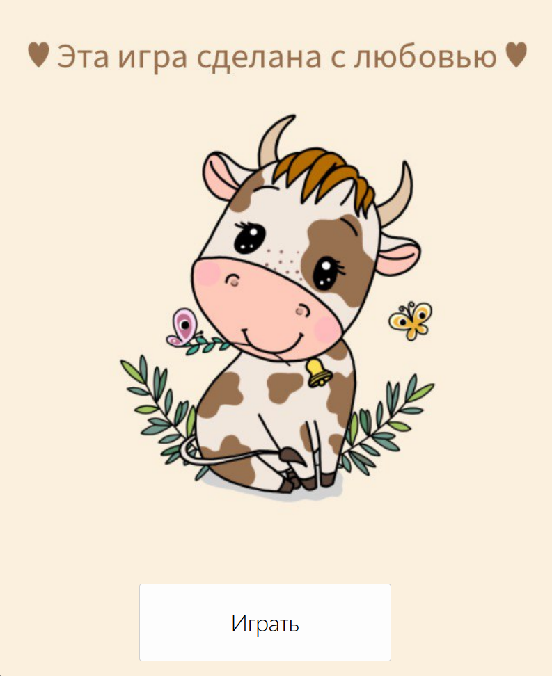
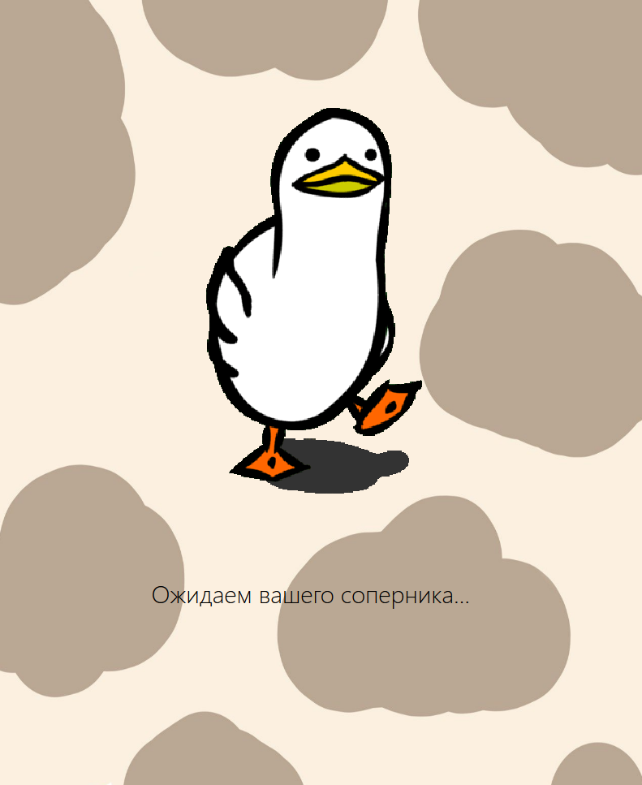
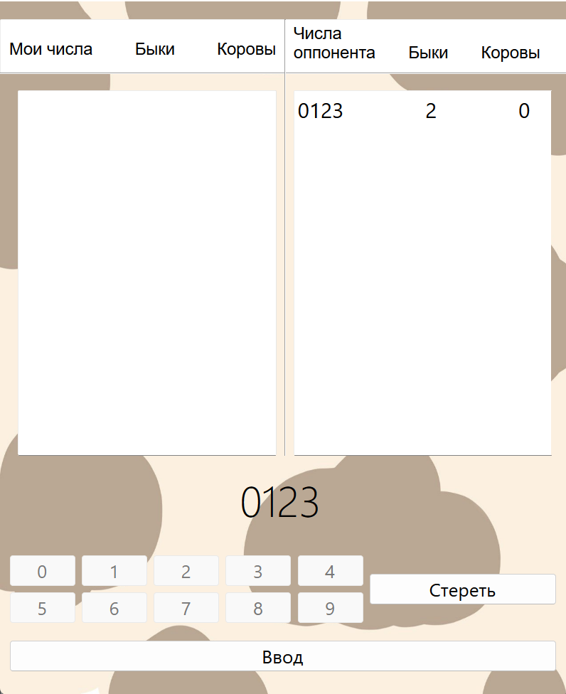
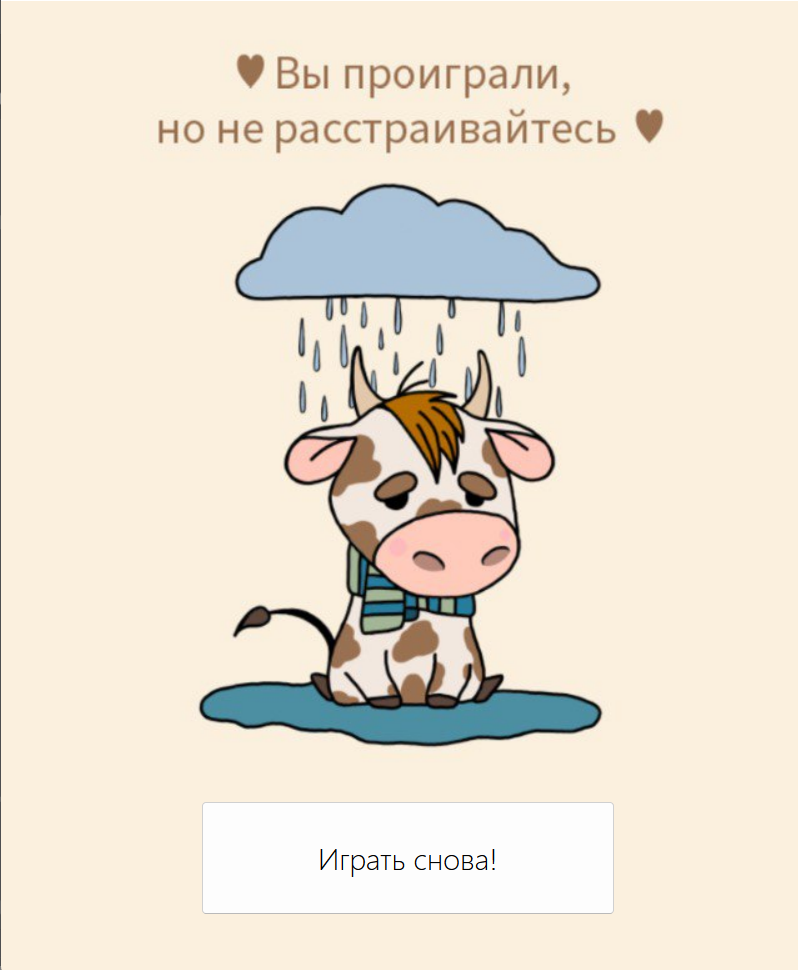

# bulls_and_cows
Game with GUI

## Contributors
| Person      | GitHub | Role |
| ----------- | ----------- |--|
| Talova Olesya | [ttalova](https://github.com/ttalova) | Developer |
| Evstratova Darya | [DashaEvstratova](https://github.com/DashaEvstratova) | Developer |

## Examples

## Project tasks
- [X] Set up sockets for playing for two
- [X] Moves can only be made in turn
- [X] Output of game results
- [X] Cute implementation for a comfortable game

